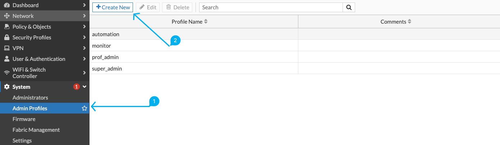
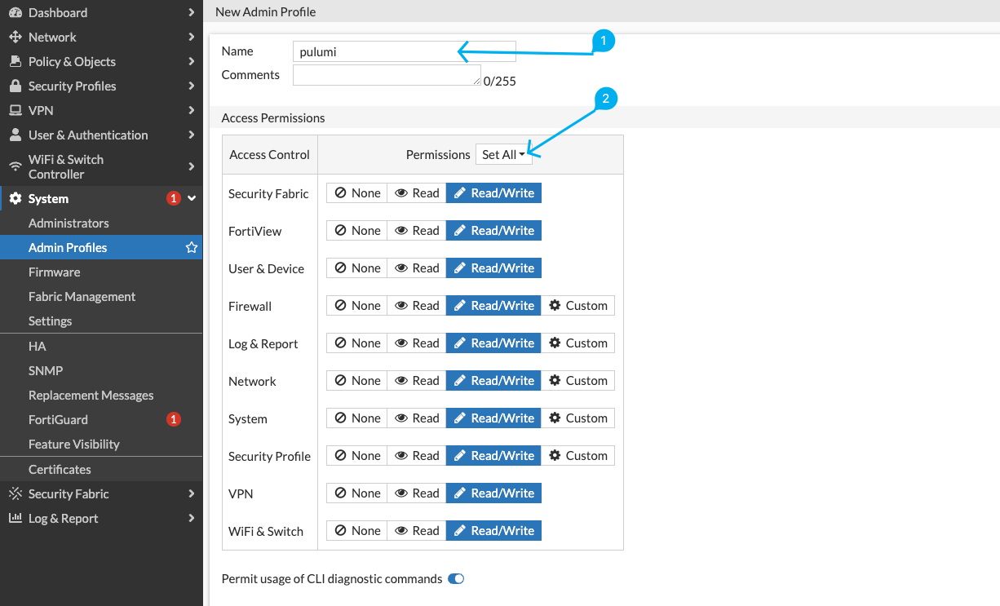
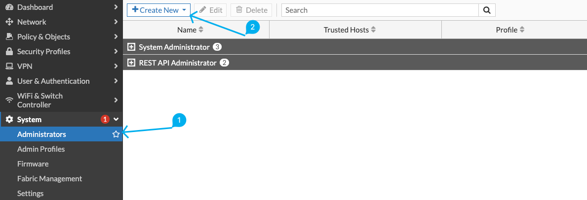
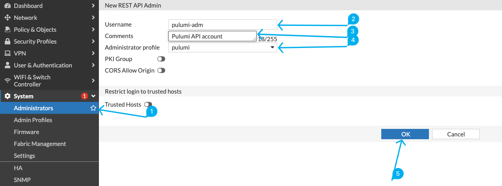

# Pulumi FortiGate example

An example Pulumi program deploying FortiGate firewall policies and objects.
This repo shows how to simplify the configuration of your FortiGate firewall and define objects and rules in YAML format for greater abstraction.

## Table of content


<!-- @import "[TOC]" {cmd="toc" depthFrom=1 depthTo=6 orderedList=false} -->

<!-- code_chunk_output -->

- [Pulumi FortiGate example](#pulumi-fortigate-example)
  - [Table of content](#table-of-content)
  - [Getting started](#getting-started)
    - [Setup FortiGate](#setup-fortigate)
    - [Setup env vars](#setup-env-vars)
    - [Init Pulumi stack](#init-pulumi-stack)
    - [Deploy new ressources](#deploy-new-ressources)
    - [Destroy ressources](#destroy-ressources)
  - [Configuration](#configuration)
    - [Add new address or subnet](#add-new-address-or-subnet)
    - [Add new address group](#add-new-address-group)
    - [Add new firewall policy](#add-new-firewall-policy)
    - [Add new service](#add-new-service)
    - [Add new service groups](#add-new-service-groups)

<!-- /code_chunk_output -->


## Getting started

### Setup FortiGate

Create a profile to assign rights to the account that will be used on your FortiGate firewall's REST API.



Give Pulumi read/write permissions so you can manage your firewall.



Now you need to create an API key ("REST API Admin").



All that remains is to create the account and store the generated API key.



### Setup env vars

You'll need to specify environment variables as follows: 

```
export FORTIOS_ACCESS_TOKEN="xxxxxx"
export FORTIOS_ACCESS_HOSTNAME="<ip_address>:<port>"
export FORTIOS_INSECURE=true
```

### Init Pulumi stack

We're now going to initialize the dev environment for our tests. You can store creds here if you don't want to use environment variables.

```
pulumi stack init dev
```

### Deploy new ressources

To deploy specified resources:

```
export PULUMI_CONFIG_PASSPHRASE=""
pulumi preview
pulumi update --non-interactive --yes
```

### Destroy ressources

```
pulumi destroy --non-interactive --yes
```

## Configuration

The configuration is stored in YAML format in the `firewall/` folder.

### Add new address or subnet

```yaml
# Adress example
testhost1:
  interface: "PROD"
  ip: "192.168.1.1"
  mask: "255.255.255.255"

# Subnet example
testsubnet1:
  interface: "PROD"
  ip: "192.168.1.0"
  mask: "255.255.255.0"
```

### Add new address group

```yaml
PROD address:
  comment: "Prod hosts group"
  members:
    - "testhost1"
    - "testhost2"
    - "testhost3"
    - "testhost4"
```

### Add new firewall policy

```yaml
myrule:
  action: "accept"
  comments: "Allow PROD to DEV ICMP ping"
  srcintfs: 
    - "PROD"
  dstintfs: 
    - "DEV"
  srcaddrs: 
    - "PROD address"
  dstaddrs: 
    - "DEV address"
  services: 
    - "ALL_ICMP"
  logtraffic: "all"
```

### Add new service

```yaml
# TCP port range
myport:
  type: "TCP" # or UDP/SCTP
  port_range: "223-332"
  visibility: "enable"
  category: "General"

ssh_port:
  type: "TCP"
  port_range: "22-22"
  visibility: "enable"
  category: "General"
```

### Add new service groups

```yaml
mygroup:
  members: 
    - "myport"
```
